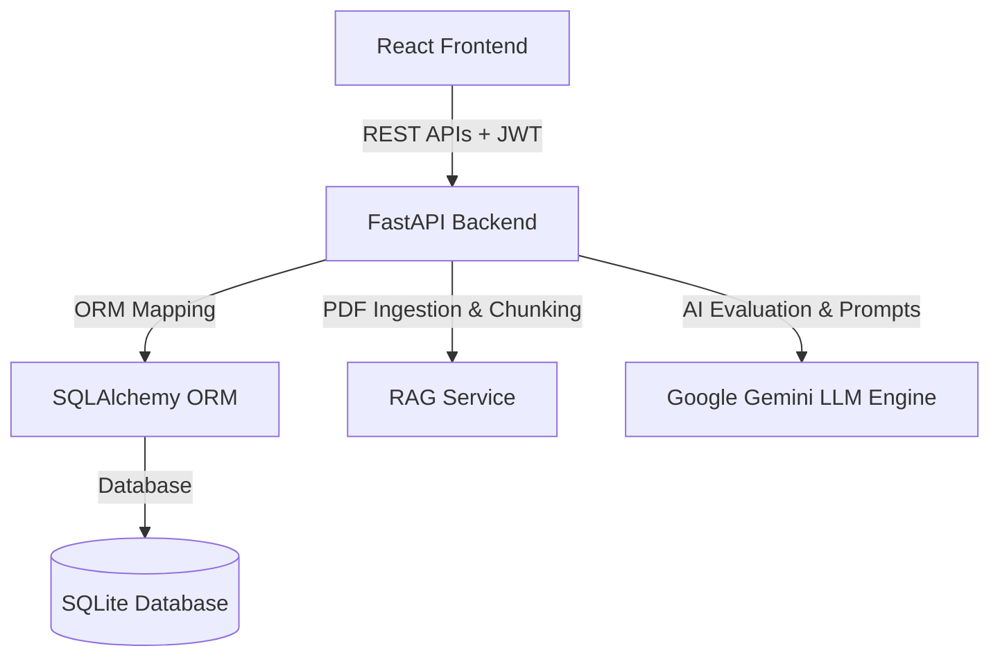

# AI Interview Preparation Platform 🚀

[](https://fastapi.tiangolo.com/)
[](https://www.python.org/)
[](https://react.dev/)
[](https://tailwindcss.com/)
[](https://www.sqlite.org/)

A full-stack, AI-powered interview preparation platform designed to help candidates practice technical and behavioral interviews, analyze resume compatibility with RAG (Retrieval-Augmented Generation), and receive real-time automated feedback.

---

## 🌟 Key Features

- **JWT Authentication & Security**: Secure token-based authentication using FastAPI, OAuth2, JWT, and Passlib BCrypt password hashing.
- **AI-Powered Mock Interviews**: Real-time interactive interview sessions with automated feedback generation powered by Google Gemini AI.
- **RAG Resume Parsing & Analysis**: Upload PDF resumes to analyze ATS compatibility, extract skills, and retrieve targeted context during mock interviews using vector similarity context retrieval.
- **Interactive Coding Evaluation**: Write code directly and receive automated execution feedback and optimization hints.
- **Modern Responsive Frontend**: Interactive React user interface built with Tailwind CSS, React Router v7, context-driven auth & theme state management, Lucide icons, and Chart.js analytics.

---

## 🏗️ System Architecture



---

## 🛠️ Tech Stack

### Frontend
- **Framework**: React 19, TypeScript
- **Styling**: Tailwind CSS v4, Lucide React (Icons)
- **Routing & Build**: React Router v7, Vite
- **Data Visualization**: Chart.js / React-ChartJS-2

### Backend
- **Framework**: Python 3.10+, FastAPI, Uvicorn
- **Security**: JWT (python-jose), Passlib (BCrypt)
- **Persistence**: SQLAlchemy ORM, SQLite
- **AI Integration**: Google Generative AI (`google-generativeai`), PyPDF

---

## 🚀 How to Run the Project

### Prerequisites
- **Node.js** (v18+)
- **Python** (3.10+)

---

### Step 1: Start the Backend (FastAPI)

1. Open a terminal and navigate to the backend directory:
   ```bash
   cd backend
   ```

2. Activate the Python virtual environment (if not already active):
   - **macOS/Linux**:
     ```bash
     source venv/bin/activate
     ```
   - **Windows**:
     ```cmd
     venv\Scripts\activate
     ```

3. *(Optional)* Install dependencies if starting fresh:
   ```bash
   pip install -r requirements.txt
   ```

4. Launch the FastAPI server with Uvicorn:
   ```bash
   uvicorn app.main:app --reload --port 8000
   ```

5. The backend will be running at:
   - **API Endpoint**: `http://localhost:8000`
   - **Interactive API Docs (Swagger UI)**: `http://localhost:8000/docs`

---

### Step 2: Start the Frontend (React + Vite)

1. Open a **second terminal tab or window** and navigate to the frontend directory:
   ```bash
   cd frontend
   ```

2. *(Optional)* Install dependencies if starting fresh:
   ```bash
   npm install
   ```

3. Start the Vite development server:
   ```bash
   npm run dev
   ```

4. Open your browser and navigate to:
   - **Web App**: `http://localhost:5173`

---

## 🛡️ API Endpoints Summary

| Endpoint | Method | Description |
| :--- | :--- | :--- |
| `/api/v1/auth/register` | `POST` | Register a new user account |
| `/api/v1/auth/token` | `POST` | Authenticate & receive JWT access token |
| `/api/v1/auth/me` | `GET` | Get current authenticated user details |
| `/api/v1/resume/upload` | `POST` | Upload PDF resume for parsing & RAG indexing |
| `/api/v1/resume/latest` | `GET` | Fetch latest user resume metadata and ATS score |
| `/api/v1/interview/start` | `POST` | Start a new AI mock interview session |
| `/api/v1/interview/{id}/message` | `POST` | Send candidate response & receive AI question/feedback |
| `/api/v1/interview/{id}/end` | `POST` | Complete interview session & generate summary analytics |
| `/api/v1/coding/evaluate` | `POST` | Evaluate user submitted code snippet |
| `/api/v1/analytics` | `GET` | Get aggregated performance metrics and progress timeline |

---

## 📝 License

Distributed under the MIT License.

